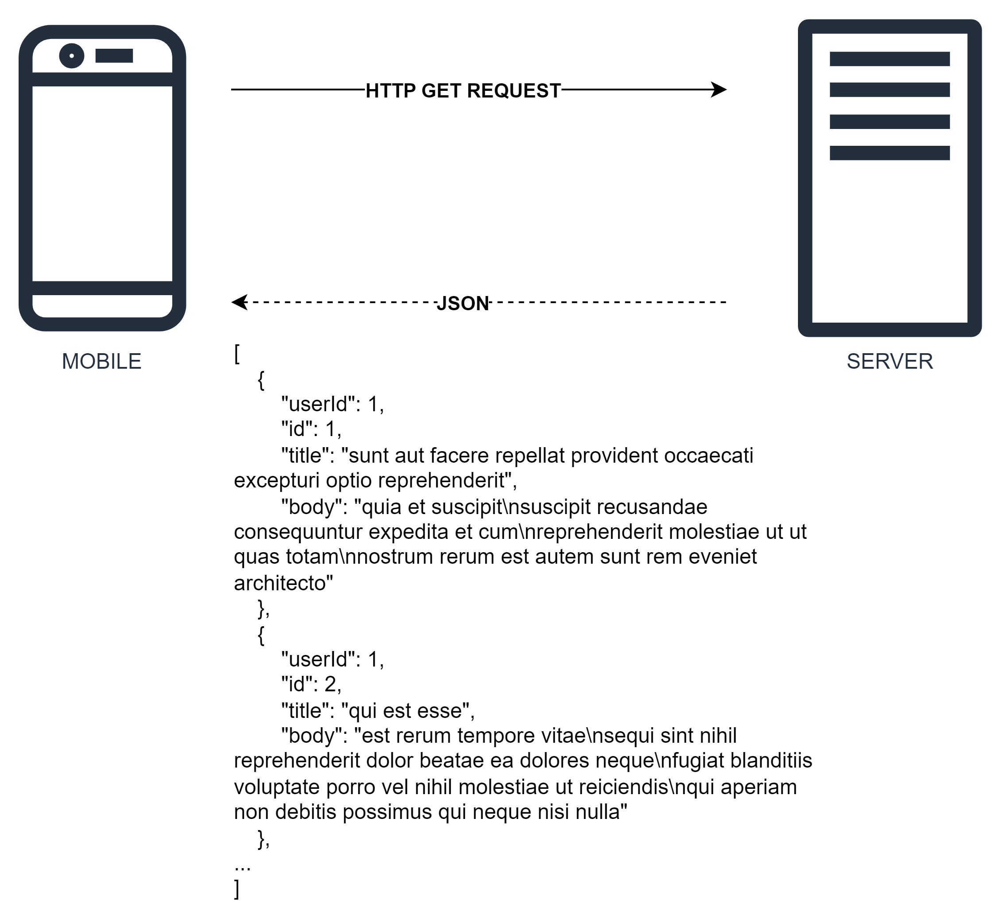
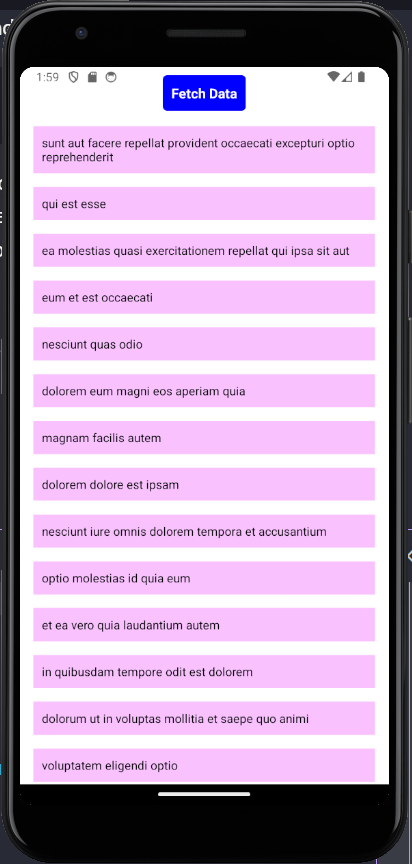
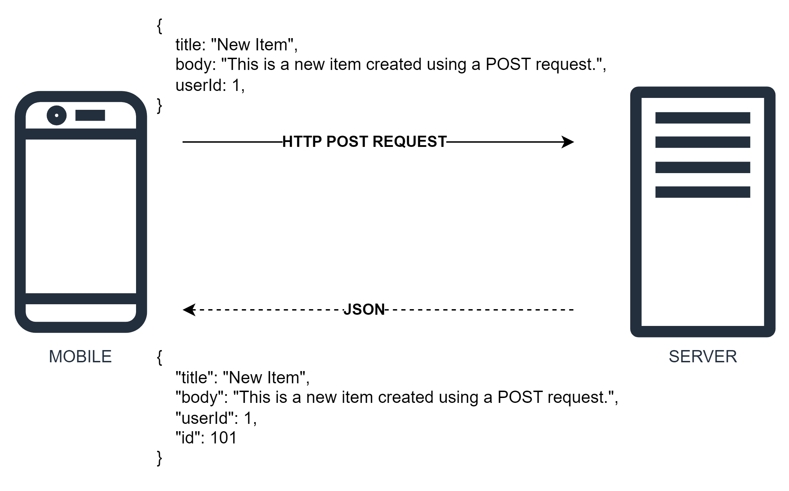
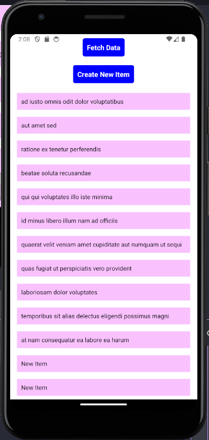

# React Native: Communication

## Handle GET Request

In this session, we will cover how to handle a `GET` request using a button and display a list of items using the `map()` function and a child component. We will use the `axios` to make the HTTP request to the `JSONPlaceholder API`.



### Setup the project

Install the project with the following command

```
npx create-expo-app comp1786-react-native-communication
cd comp1786-react-native-communication
```

Install `axios` dependency

```
npm install axios
```

### Create the Components

Create file `ListItem.js`

`ListItem.js` - This will be our child component responsible for rendering individual list items:

```js
// ListItem.js
import React from "react";
import { StyleSheet, Text, View } from "react-native";

const ListItem = ({ item }) => {
  return (
    <View style={styles.item}>
      <Text>{item.title}</Text>
    </View>
  );
};

const styles = StyleSheet.create({
  item: {
    padding: 10,
    marginVertical: 8,
    marginHorizontal: 16,
    backgroundColor: "#f9c2ff",
  },
});

export default ListItem;
```

`App.js` - This will be our main component where we will handle the GET request and display the list:

```js
// App.js
import React, { useState } from "react";
import {
  View,
  Text,
  FlatList,
  TouchableOpacity,
  StyleSheet,
} from "react-native";
import axios from "axios";
import ListItem from "./ListItem";

const App = () => {
  const [data, setData] = useState([]);

  const handleGetRequest = async () => {
    try {
      const response = await axios.get(
        "https://jsonplaceholder.typicode.com/posts"
      );
      setData(response.data);
    } catch (error) {
      console.error("Error fetching data:", error);
    }
  };

  return (
    <View style={styles.container}>
      <TouchableOpacity onPress={handleGetRequest} style={styles.button}>
        <Text style={styles.buttonText}>Fetch Data</Text>
      </TouchableOpacity>
      <FlatList
        data={data}
        renderItem={({ item }) => <ListItem item={item} />}
        keyExtractor={(item) => item.id.toString()}
      />
    </View>
  );
};

const styles = StyleSheet.create({
  container: {
    flex: 1,
    justifyContent: "center",
    alignItems: "center",
    backgroundColor: "#fff",
  },
  button: {
    backgroundColor: "blue",
    padding: 10,
    borderRadius: 5,
    marginVertical: 10,
  },
  buttonText: {
    color: "#fff",
    fontSize: 16,
    fontWeight: "bold",
  },
});

export default App;
```

After that, run it with the following command

```
npx expo start
```

This will build and run the app on your device/emulator. You should see a button "Fetch Data" in the middle of the screen. Pressing this button will fetch data from the JSONPlaceholder API and display a list of items below the button.



## Handle POST Request

We'll add a new button to the app that, when pressed, will send a POST request to the JSONPlaceholder API to create a new item.



In `App.js`, add a new button and a function to handle the POST request:

```js
import React, { useState } from "react";
import {
  View,
  Text,
  FlatList,
  TouchableOpacity,
  StyleSheet,
} from "react-native";
import axios from "axios";
import ListItem from "./ListItem";

const App = () => {
  const [data, setData] = useState([]);

  const handleGetRequest = async () => {
    try {
      const response = await axios.get(
        "https://jsonplaceholder.typicode.com/posts"
      );
      setData(response.data);
    } catch (error) {
      console.error("Error fetching data:", error);
    }
  };

  const handlePostRequest = async () => {
    try {
      const response = await axios.post(
        "https://jsonplaceholder.typicode.com/posts",
        {
          title: "New Item",
          body: "This is a new item created using a POST request.",
          userId: 1,
        }
      );
      setData([...data, response.data]);
    } catch (error) {
      console.error("Error creating item:", error);
    }
  };

  return (
    <View style={styles.container}>
      <TouchableOpacity onPress={handleGetRequest} style={styles.button}>
        <Text style={styles.buttonText}>Fetch Data</Text>
      </TouchableOpacity>
      <TouchableOpacity onPress={handlePostRequest} style={styles.button}>
        <Text style={styles.buttonText}>Create New Item</Text>
      </TouchableOpacity>
      <FlatList
        data={data}
        renderItem={({ item }) => <ListItem item={item} />}
        keyExtractor={(item) => item.id.toString()}
      />
    </View>
  );
};

// ...styles remain the same
```

You should now see two buttons: `Fetch Data` and `Create New Item`.

Pressing the `Fetch Data` button will fetch the existing data from the JSONPlaceholder API and display it in the list.

Pressing the `Create New Item` button will send a `POST` request to the API, and the new item will be added to the list without the need to refresh the whole list.


